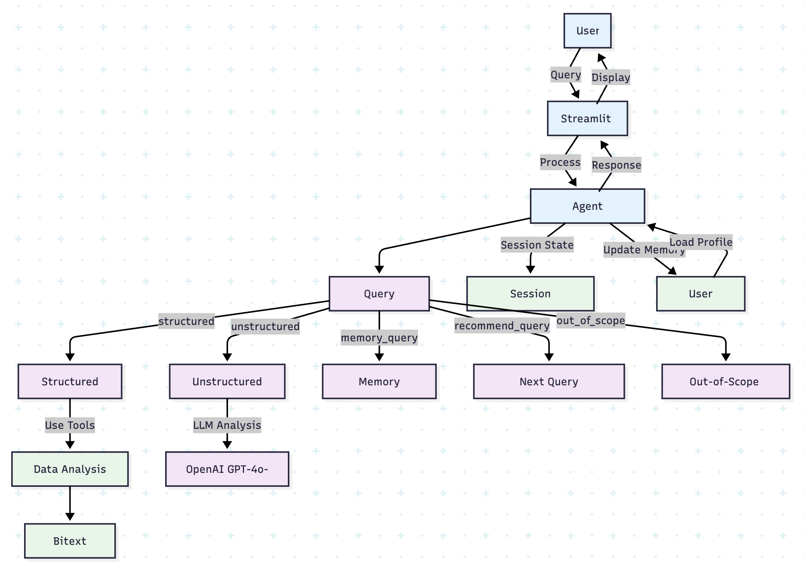
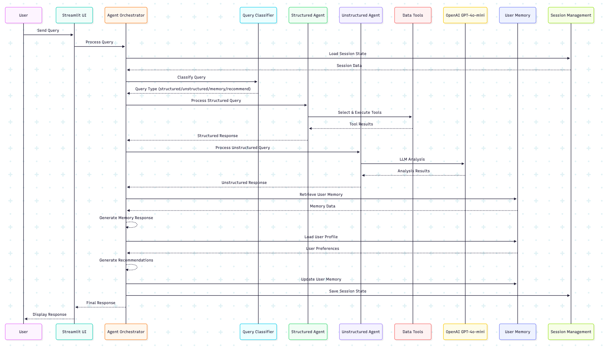
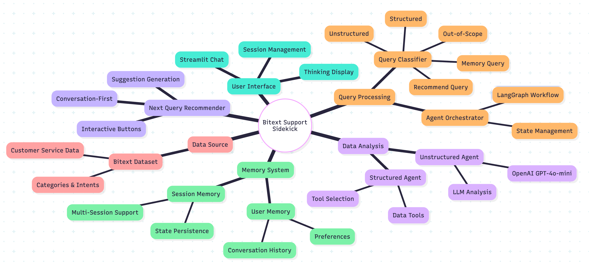
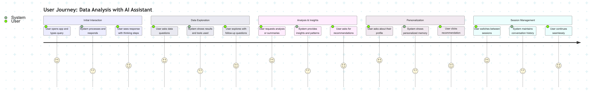

# Bitext Support Sidekick

## Overview

This project implements an intelligent agent that can answer questions about customer service data through a conversational interface. The agent uses LangGraph for structured workflow management and can handle both structured queries (e.g., "What are the most frequent categories?") and unstructured analysis (e.g., "Summarize Category X").

## Features

- Interactive chat interface built with Streamlit
- LangGraph-based workflow with specialized nodes:
  - **Query Classification** – intelligently determines query type (structured, unstructured, recommendations, memory, out-of-scope)
  - **Structured Agent** – handles direct, specific data queries
  - **Unstructured Agent** – handles analysis, summaries, and conversational questions
  - **Out-of-Scope Handler** – manages off-topic questions
  - **Summary Node** – updates and stores user memory after each turn
  - **Memory Response** – provides human-readable memory summaries with data
  - **Next Query Recommender** – suggests relevant next queries with conversation-first approach
- Data analysis capabilities:
  - Category analysis and distribution
  - Intent analysis
  - Semantic search
  - Exact search
  - Data aggregation
  - Common questions identification
  - Calculator
- Automatic scope checking to filter out-of-topic questions
- Transparent reasoning with detailed thinking steps and console logging
- Tool-based architecture for modular functionality
- **Multi-session management** with sidebar session switching and conversation persistence
- **Summarized user memory** (profile, preferences, interests) stored in human-readable JSON
- **Conversation-first recommendations** - suggestions appear as buttons only after conversational interaction
- **Refined classification** - distinguishes between conversational questions and explicit recommendation requests

> **Note:** This implementation focuses on the core LangGraph requirements and new bonus features. The original reactive/plan thinking modes from part 1 have been replaced with the more sophisticated LangGraph workflow architecture.

## Architecture & Structure

The application follows a **Domain-Driven Design (DDD)** architecture with **LangGraph workflow orchestration**. The system is built around a **state-driven workflow** that processes user queries through specialized nodes.

### **High-Level Architecture**

```
┌─────────────────┐    ┌─────────────────┐    ┌─────────────────┐
│   Streamlit UI  │    │   LangGraph     │    │   Data Tools    │
│   (app.py)      │◄──►│   Workflow      │◄──►│   (tools/)      │
│                 │    │   (brain/)      │    │                 │
└─────────────────┘    └─────────────────┘    └─────────────────┘
         │                       │                       │
         │                       │                       │
         ▼                       ▼                       ▼
┌─────────────────┐    ┌─────────────────┐    ┌─────────────────┐
│   Session       │    │   State         │    │   User Memory   │
│   Management    │    │   Management    │    │   (JSON File)   │
│   (Sidebar)     │    │   (MemorySaver) │    │                 │
└─────────────────┘    └─────────────────┘    └─────────────────┘
```

### **LangGraph Workflow Architecture**

The core of the system is a **state-driven workflow** that routes queries through specialized processing nodes:

```
                    ┌─────────────────┐
                    │   User Query    │
                    │   (Entry Point) │
                    └─────────┬───────┘
                              │
                              ▼
                    ┌─────────────────┐
                    │   Classifier    │
                    │   (brain/       │
                    │   classifier.py)│
                    └─────────┬───────┘
                              │
                    ┌─────────┴───────┐
                    │                 │
                    ▼                 ▼
            ┌─────────────┐   ┌─────────────┐
            │ Structured  │   │Unstructured │
            │   Agent     │   │   Agent     │
            │             │   │             │
            └─────┬───────┘   └─────┬───────┘
                  │                 │
                  ▼                 ▼
            ┌─────────────┐   ┌─────────────┐
            │   Tools     │   │   LLM       │
            │ Selection   │   │ Analysis    │
            │ & Execution │   │ & Summary   │
            └─────┬───────┘   └─────┬───────┘
                  │                 │
                  └─────────┬───────┘
                            │
                            ▼
                    ┌─────────────────┐
                    │   Summary       │
                    │   (Memory       │
                    │   Update)       │
                    └─────────┬───────┘
                              │
                              ▼
                    ┌─────────────────┐
                    │   Final         │
                    │   Response      │
                    └─────────────────┘
```

### **Specialized Routing Paths**

The classifier routes queries to different specialized nodes:

- **`structured`** → Structured Agent → Tools → Summary → Response
- **`unstructured`** → Unstructured Agent → LLM Analysis → Summary → Response  
- **`memory_query`** → Memory Response → Response
- **`recommend_query`** → Recommender → Response
- **`out_of_scope`** → Out-of-Scope Handler → Summary → Response

### **State Management Architecture**

The system uses **LangGraph's MemorySaver** for persistent state management:

```python
class AgentState(TypedDict):
    messages: List[Dict[str, Any]]     # Conversation history
    user_message: str                  # Current user input  
    query_type: str | None             # Classified query type
    session_id: str | None             # Session identifier
    user_memory: Dict[str, Any]        # User preferences
    current_step: str                  # Current processing step
    final_answer: str | None           # Final response
```

### **Component Architecture**

```
bitext_support_sidekick/
│
├── app.py                  # Streamlit UI (entry point)
├── agent.py                # Agent orchestrator (LangGraph interface)
├── user_memory.json        # Human-readable user memory
│
├── brain/                  # Domain logic (agent brain, nodes, workflow)
│   ├── classifier.py       # Query classification node
│   ├── graph.py            # LangGraph workflow definition
│   ├── structured_agent.py # Structured query node
│   ├── unstructured_agent.py # Unstructured query node
│   ├── out_of_scope.py     # Out-of-scope handler node
│   ├── summary.py          # Summarized memory node
│   ├── recommender.py      # Next query recommender node
│   ├── memory_manager.py   # User memory file I/O
│   ├── final_response.py   # Final response formatting
│   ├── ...
│
├── chat/                   # Messaging and LLM service abstraction
│   ├── message.py          # Message model and helpers
│   ├── service.py          # LLM API wrapper
│
├── tools/                  # Data analysis tools (domain-specific)
│   ├── aggregator.py, calculator.py, ...
│   ├── tools.py            # Tool registry/schema
│
├── scope_checker/          # Scope checking logic
│   ├── checker.py
│   ├── scope.py
│
├── assets/                 # Diagrams, images
├── notebooks/              # Jupyter notebooks (for dev/testing)
├── requirements.txt
├── README.md
```

### **Key Architectural Principles**

- **Domain-Driven Design**: Code organized by business domain, not technology
- **State-Driven Workflow**: LangGraph manages state transitions and persistence
- **Modular Nodes**: Each processing step is a separate, testable node
- **Tool-Based Architecture**: Data analysis capabilities as pluggable tools
- **Session Persistence**: Multi-conversation support with state restoration
- **Memory Management**: User memory stored in human-readable JSON format

## System Diagrams

Below are four diagrams that explain how the LangGraph-powered data analyst agent works:

- **System Flowchart** – shows all main components and how they connect in the LangGraph workflow architecture.
- **Sequence Diagram** – illustrates the step-by-step process from user query to final response, including query classification and agent routing.
- **Mind Map** – provides a hierarchical overview of all system features, capabilities, and components in a tree structure.
- **User Journey** – demonstrates the complete user experience and what happens behind the scenes during a typical interaction.






## Session Management & Memory

### **Multi-Session Support**
- **Sidebar session list** - View and switch between multiple conversations
- **Conversation persistence** - Each session maintains its full conversation history
- **Session restoration** - Switching sessions restores the complete conversation state
- **Automatic session creation** - New sessions are created when needed

### **User Memory System**
- **Persistent memory** - User preferences and interests stored in `user_memory.json`
- **Human-readable format** - Memory stored as natural language summaries
- **Memory queries** - Ask "What do you remember about me?" to see your profile
- **Data display** - Memory responses show actual memory data in thinking section
- **Cross-session sharing** - Memory is shared across all sessions for the same user

## Next Query Recommender (Bonus Feature)

The agent can proactively suggest relevant next queries based on your user profile and conversation history, but with a **conversation-first approach**:

### **How It Works:**
1. **Conversational questions** like "What should I ask next?" or "Advise me what to query next" trigger a conversation
2. **The agent explains** why certain queries would be interesting based on your profile
3. **Only then** does it present clickable suggestion buttons
4. **You can click** any suggestion to execute it immediately

### **Example Flow:**
- User: "What should I ask next?"
- Agent: "Based on your interest in category analysis, I think you'd find these queries interesting: [explanation]"
- Agent: [shows 2-3 clickable suggestion buttons]
- User: [clicks "Show me the most frequent categories"]
- Agent: [executes the query and returns results]

### **Refined Classification:**
- **Conversational requests** → Unstructured agent (conversation first)
- **Explicit requests** like "Give me recommendations" → Direct to recommender (buttons immediately)

## Quickstart

### Prerequisites
- **Python 3.10.18** (or any Python 3.10+ version)
- **OpenAI API key** (get one from [OpenAI Platform](https://platform.openai.com/api-keys))

### Step 1: Set Up Your Environment
```bash
# Clone the repository (if you haven't already)
git clone <repository-url>
cd bitext_support_sidekick

# Create a virtual environment
python -m venv venv

# Activate the virtual environment
# On macOS/Linux:
source venv/bin/activate
# On Windows:
# venv\Scripts\activate
```

### Step 2: Install Dependencies
```bash
# Install all required packages
pip install -r requirements.txt
```

**What gets installed:**
- **LangGraph 0.5.3** - Workflow orchestration
- **LangChain 0.3.26** - LLM framework
- **OpenAI 1.97.0** - GPT-4o-mini integration
- **Streamlit 1.27.0** - Web interface
- **Pandas 2.3.0** - Data manipulation
- **Sentence Transformers 4.1.0** - Semantic search
- **And 10+ other supporting libraries**

### Step 3: Configure Your API Key
```bash
# Set your OpenAI API key as an environment variable
export OPENAI_API_KEY=sk-your-api-key-here

# Or create a .env file in the project root:
echo "OPENAI_API_KEY=sk-your-api-key-here" > .env
```

### Step 4: Launch the Application
```bash
# Start the Streamlit web interface
streamlit run app.py
```

The app will open in your browser at `http://localhost:8501`

### Step 5: Start Exploring
Try these example queries to test different features:

**📊 Data Analysis Queries:**
- "What are the most frequent categories?"
- "Show me the top 5 categories by count"
- "How many records are in the dataset?"

**🔍 Analysis & Summaries:**
- "Summarize the ACCOUNT category"
- "What patterns do you see in the data?"
- "Tell me about the most common intents"

**🧠 Memory & Personalization:**
- "What do you remember about me?"
- "What should I ask next?"
- "Based on my interests, what would be interesting to explore?"

**🔄 Session Management:**
- Use the sidebar to create new sessions
- Switch between different conversations
- Each session maintains its own conversation history

## System Requirements

- **Python:** 3.10.18 (or any 3.10+ version)
- **Operating System:** macOS, Linux, or Windows
- **Memory:** 4GB RAM minimum (8GB recommended)
- **Storage:** 2GB free space for dependencies and data
- **Internet:** Required for OpenAI API calls

## Key Dependencies

| Package | Version | Purpose |
|---------|---------|---------|
| **LangGraph** | 0.5.3 | Workflow orchestration |
| **LangChain** | 0.3.26 | LLM framework |
| **OpenAI** | 1.97.0 | GPT-4o-mini API |
| **Streamlit** | 1.27.0 | Web interface |
| **Pandas** | 2.3.0 | Data manipulation |
| **Sentence Transformers** | 4.1.0 | Semantic search |
| **Pydantic** | 2.11.5 | Data validation |
| **NumPy** | 1.24.3 | Numerical computing |
| **Scikit-learn** | 1.3.0 | Machine learning |
| **PyTorch** | 2.1.2 | Deep learning backend |

## Extending the Agent

- **Add new tools:** Implement a new function in `tools/` and register it in `tools.py`.
- **Add new agent nodes:** Create a new node in `brain/` and add it to the workflow in `graph.py`.
- **Customize user memory:** Edit `brain/summary.py` and `brain/memory_manager.py`.
- **Modify classification:** Update `brain/classifier.py` for new query types.

## Clean Code & DDD Principles

- All code is organized by business domain, not technology.
- Naming is clear, descriptive, and domain-focused.
- Each node and major function is documented with a docstring.
- The user memory file is human-readable and self-explanatory.
- Transparent thinking steps with detailed reasoning in both UI and console.

---

**You're ready to submit!** 
